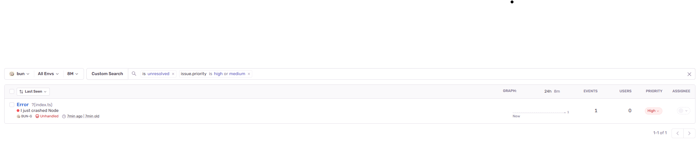
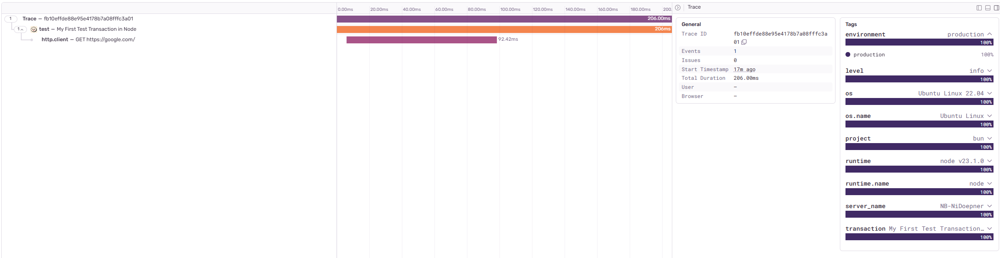
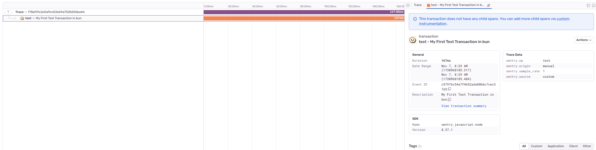

# Bun
Using bun version 1.1.7
```
# update dsn in instrumentation.ts
cd test-bun
bun install
bun run index.ts
```


# Node
Using v23.1.0
```
# update dsn in instrumentation.ts
cd test-node
npm install
node --experimental-strip-types index.ts
```


## Errors
bun error is not caught


## Traces

### Spans are created for fetch in node


### No spans are created for fetch in Bun



### Logs bun
```
Sentry Logger [log]: Initializing Sentry: process: 363858, thread: main.
Sentry Logger [log]: Integration installed: InboundFilters
Sentry Logger [log]: Integration installed: FunctionToString
Sentry Logger [log]: Integration installed: LinkedErrors
Sentry Logger [log]: Integration installed: RequestData
Sentry Logger [log]: Integration installed: Console
Sentry Logger [log]: Integration installed: Http
Sentry Logger [log]: Integration installed: NodeFetch
Sentry Logger [log]: Integration installed: OnUncaughtException
Sentry Logger [log]: Integration installed: OnUnhandledRejection
Sentry Logger [log]: Integration installed: ContextLines
Sentry Logger [log]: Integration installed: Context
Sentry Logger [log]: Integration installed: Modules
Sentry Logger [log]: Integration installed: BunServer
Sentry Logger [log]: Running in CommonJS mode.
Sentry Logger [debug]: @opentelemetry/api: Registered a global for diag v1.9.0.
Sentry Logger [debug]: @opentelemetry/api: Registered a global for trace v1.9.0.
Sentry Logger [debug]: @opentelemetry/api: Registered a global for context v1.9.0.
Sentry Logger [debug]: @opentelemetry/api: Registered a global for propagation v1.9.0.
Sentry Logger [log]: [Tracing] Starting sampled root span
  op: test
  name: My First Test Transaction in bun
  ID: 69532902557e1163
Sentry Logger [log]: [Tracing] Finishing "test" root span "My First Test Transaction in bun" with ID 69532902557e1163
Sentry Logger [log]: SpanExporter exported 1 spans, 0 unsent spans remaining
12 | );
13 | 
14 | const sleep = () => new Promise((res) => setTimeout(() => res("hi"), 3000));
15 | 
16 | await sleep();
17 | throw new Error("I just crashed Bun");
           ^
error: I just crashed Bun
      at /home/doepnern/projects/sentry-node-bun-comparison/test-bun/index.ts:17:7
```

### Logs node
```
(node:364484) ExperimentalWarning: Type Stripping is an experimental feature and might change at any time
(Use `node --trace-warnings ...` to show where the warning was created)
Sentry Logger [log]: Initializing Sentry: process: 364484, thread: main.
Sentry Logger [log]: Integration installed: InboundFilters
Sentry Logger [log]: Integration installed: FunctionToString
Sentry Logger [log]: Integration installed: LinkedErrors
Sentry Logger [log]: Integration installed: RequestData
Sentry Logger [log]: Integration installed: Console
Sentry Logger [log]: Integration installed: Http
Sentry Logger [log]: Integration installed: NodeFetch
Sentry Logger [log]: Integration installed: OnUncaughtException
Sentry Logger [log]: Integration installed: OnUnhandledRejection
Sentry Logger [log]: Integration installed: ContextLines
Sentry Logger [log]: Integration installed: LocalVariablesAsync
Sentry Logger [log]: Integration installed: Context
Sentry Logger [log]: Integration installed: ProcessAndThreadBreadcrumbs
Sentry Logger [log]: Integration installed: Express
Sentry Logger [log]: Integration installed: Fastify
Sentry Logger [log]: Integration installed: Graphql
Sentry Logger [log]: Integration installed: Mongo
Sentry Logger [log]: Integration installed: Mongoose
Sentry Logger [log]: Integration installed: Mysql
Sentry Logger [log]: Integration installed: Mysql2
Sentry Logger [log]: Integration installed: Redis
Sentry Logger [log]: Integration installed: Postgres
Sentry Logger [log]: Integration installed: Nest
Sentry Logger [log]: Integration installed: Hapi
Sentry Logger [log]: Integration installed: Koa
Sentry Logger [log]: Integration installed: Connect
Sentry Logger [log]: Integration installed: GenericPool
Sentry Logger [log]: Integration installed: Kafka
Sentry Logger [log]: Integration installed: Amqplib
Sentry Logger [log]: Integration installed: LruMemoizer
Sentry Logger [log]: Running in ESM mode.
Sentry Logger [debug]: @opentelemetry/api: Registered a global for diag v1.9.0.
Sentry Logger [debug]: @opentelemetry/api: Registered a global for trace v1.9.0.
Sentry Logger [debug]: @opentelemetry/api: Registered a global for context v1.9.0.
Sentry Logger [debug]: @opentelemetry/api: Registered a global for propagation v1.9.0.
Sentry Logger [log]: [Tracing] Starting sampled root span
  op: test
  name: My First Test Transaction in Node
  ID: bfcc8ae43458cab3
Sentry Logger [log]: [Tracing] Inheriting parent's sampled decision for GET: true
Sentry Logger [log]: [Tracing] Starting sampled span
  op: < unknown op >
  name: GET
  ID: 2bbd3f9ba84b5953
  parent ID: bfcc8ae43458cab3
  root ID: bfcc8ae43458cab3
  root op: test
  root description: My First Test Transaction in Node
(node:364484) ExperimentalWarning: Type Stripping is an experimental feature and might change at any time
(Use `node --trace-warnings ...` to show where the warning was created)
Sentry Logger [log]: [Tracing] Finishing "< unknown op >" span "GET" with ID 2bbd3f9ba84b5953
Sentry Logger [log]: SpanExporter has 1 unsent spans remaining
Sentry Logger [log]: [Tracing] Inheriting parent's sampled decision for GET: true
Sentry Logger [log]: [Tracing] Starting sampled span
  op: < unknown op >
  name: GET
  ID: ef7e1376d3649f80
  parent ID: bfcc8ae43458cab3
  root ID: bfcc8ae43458cab3
  root op: test
  root description: My First Test Transaction in Node
Sentry Logger [log]: [Tracing] Finishing "test" root span "My First Test Transaction in Node" with ID bfcc8ae43458cab3
Sentry Logger [log]: SpanExporter exported 2 spans, 0 unsent spans remaining
Sentry Logger [log]: [Tracing] Finishing "< unknown op >" span "GET" with ID ef7e1376d3649f80
Sentry Logger [log]: SpanExporter has 1 unsent spans remaining
Error: I just crashed Node
    at file:///home/doepnern/projects/sentry-node-bun-comparison/test-node/index.ts:17:7
Sentry Logger [log]: SpanExporter exported 0 spans, 1 unsent spans remaining
Sentry Logger [log]: Flushing outcomes...
Sentry Logger [log]: No outcomes to send
```